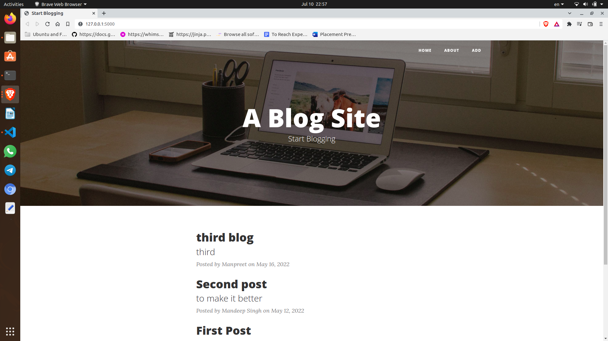
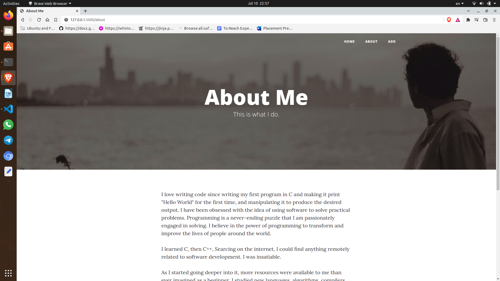
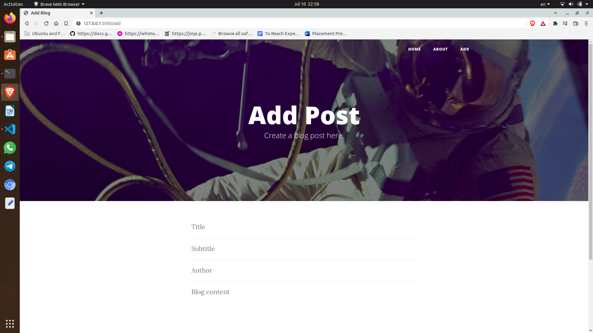
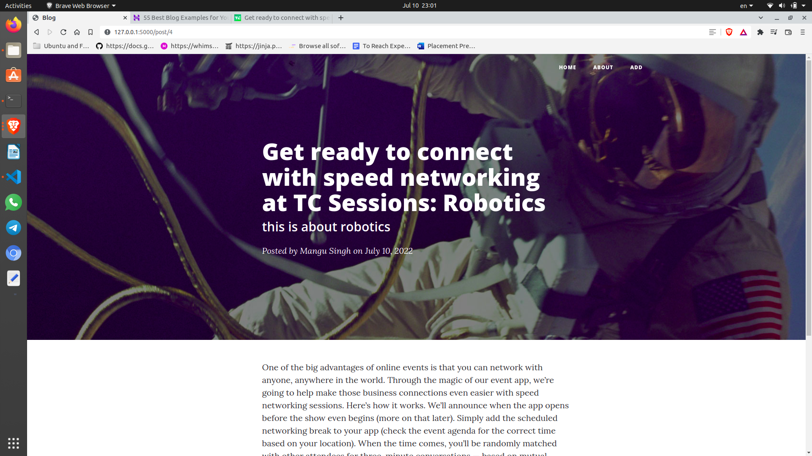

# Blog-App

Website to read and upload a blog.

## Tech Stack
### Frontend:
* HTML
* CSS
* Boostrap

### Backend+db (preferred):
* Flask
* SQLite

<!--
## Components

### Login and Register
User have to register and login first to access the web.

### Create Deck
User can create a deck and add cards into the deck.

### Update and Delete Deck
User can delete and update decks.
-->
## Ongoing work :man_technologist:
Creating login and logout system. Working on delete and update of a blog post.

## Screenshots

| | |
|:-------------------------:|:-------------------------:|
| | |
|  |  |

## Contributors :trophy:

